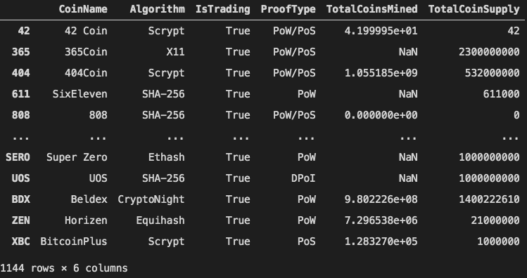
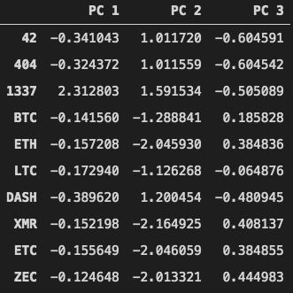
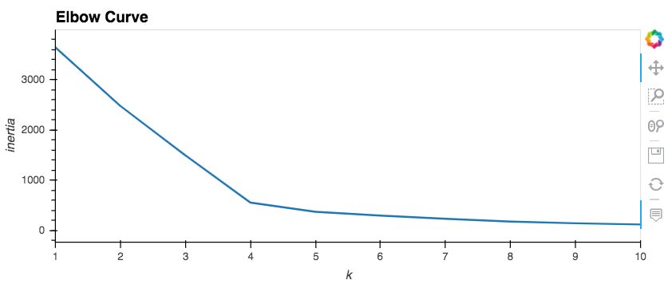
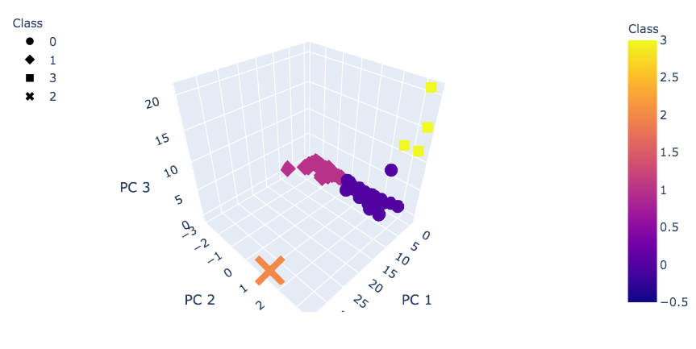

# **Cryptocurrencies**  

## **Overview of Project**
In this project we are trying to identify the cryptocurrencies on trading market and find out how they can be grouped together using unsupervised machine learning, python and sklearn library.

### **Project Summary**

Our data source is the coin list obtained from [cryptocompare.com](https://www.cryptocompare.com/). [Fig. 1](screen_shots/1.png) shows a part of this dataset. The data itself can be found in "[crypto_data.csv](crypto_data.csv)":  

|*Fig. 1*|
:--:
||

&nbsp;

The following work was done on the data to make it ready for our machine learning model:
- Cleaning the dataset by keeping only the coins which are being traded, has working algorithm and have been mined, dropping the rows of data that contained null values, dropping the "CoinName" and "IsTrading" columns
- Using "get_dummies()" method to create variables for the two text features, "Algorithm" and "ProofType"
&nbsp;

At the end of the previous step our dataset had 532 data points with 98 features. After the data in our new dataset was standardized using "StandardScaler", a Principal Components Analysis was performed to reduce the dimensions of the data. We chose three Principal Components to continue our project.[Fig. 2](screen_shots/pca.png) shows a view of the transformed data for using in the machine learning model:  

|*Fig. 2*|
:--:
||

&nbsp;

For this analysis we used the K_means algorithm to cluster the cryptocurrencies. An elbow curve method was employed to determine the optimum number of clusters. As you can see in [Fig. 3](screen_shots/elbow.png), there is a break in the curve at K=4 (4 clusters) and after that the curve is tending to a horizontal line. This suggests that we can choose 4 clusters to perform our analysis  

|*Fig. 3*|
:--:
||

&nbsp;

Using the K-means algorithm the cryptocurrencies were grouped into 4 clusters that are shown in [Fig. 4](screen_shots/3D-kmeans.png)

|*Fig. 4*|
:--:
||

